---
## Author
author:
  name: Аристова Арина Олеговна
  degrees: MSc
  email: 1032259382@rudn.ru
  affiliation:
    - name: Российский университет дружбы народов
      country: Российская Федерация
      postal-code: 117198
      city: Москва
      address: ул. Миклухо-Маклая, д. 6

## Title
title: "Лабораторная работа №2"
subtitle: "Основы вероятностного моделирования угроз"
license: "CC BY"
---

# Цель работы

Освоить базовые методы вероятностного моделирования случайных процессов в контексте кибербезопасности.

На примере моделирования потока атак на веб-сервер изучить:

- генерацию случайных величин с заданным распределением;
- статистический анализ смоделированных данных;
- проверку соответствия эмпирического распределения теоретическому;
- оценку вероятностей редких событий;
- определить набор параметров модели (интенсивность атак, длительность наблюдения и т.д.);
- реализовать симуляцию пуассоновского потока атак;
- выполнить статистический анализ результатов;
- визуализировать данные и проверить соответствие теоретическим распределениям.

# Задание

1. Создать проект DrWatson с именем project.
2. Определить набор параметров модели (словарь params) с возможностью варьирования.
3. Написать функцию simulate_attacks(params), которая возвращает структуру с результатами симуляции (например, массив числа атак по часам, интервалы, моменты времени).
4. Использовать produce_or_load для запуска симуляции с заданными параметрами и сохранения результатов на диск.
5. Провести серию экспериментов с разными значениями параметров (например, разные $\lambda$, разная длительность).
6. Загрузить сохранённые результаты и выполнить:
   - построение гистограммы числа атак за час и сравнение с теоретическим распределением Пуассона;
   - построение графика накопленного числа атак и интервалов между атаками;
   - проверку экспоненциальности интервалов (гистограмма, QQ-plot, возможно критерий согласия);
   - оценку вероятности события «более 10 атак за час» теоретически и эмпирически.
7. Проанализировать зависимость точности оценки вероятности от числа симуляций.


# Теоретическое введение

Во многих задачах кибербезопасности поток атак (или инцидентов) можно приближённо считать простейшим (пуассоновским) потоком. Для такого потока число событий $N_t$ за время $t$ распределено по закону Пуассона:

$$P(N_t = k) = \frac{(\lambda t)^k}{k!} e^{-\lambda t}, \quad k = 0, 1, 2, \dots$$

где $\lambda$ — интенсивность потока (среднее число событий в единицу времени).

В простейшем потоке интервалы времени между соседними событиями $\tau_1, \tau_2, \dots$ независимы и имеют экспоненциальное распределение с параметром $\lambda$:

$$f(\tau) = \lambda e^{-\lambda \tau}, \quad \tau \geq 0$$

Среднее значение интервала: $\mathbb{E}[\tau] = 1/\lambda$.


# Выполнение лабораторной работы

Представленные скрипты образуют исследовательский конвейер:

- Моделирование (simulation.jl) — вычислительное ядро.
- Генерация данных (run_experiment.jl) — получение реализаций для фиксированных параметров.
- Анализ и визуализация (analyze.jl) — проверка соответствия модели теоретическим распределениям.
- Исследование сходимости (convergence.jl) — изучение точности оценок.
- Параметрическое исследование (parameter_sweep.jl) — анализ чувствительности к изменению интенсивности.

Для выполнения работы необходимо создать проект с помощью DrWatson. Затем создадим в этом проекте скрипт src/simulation.jl, который содержит функцию simulate_attacks, реализующую вероятностную модель потока атак.

## Создание и инициализация проекта DrWatson

{#fig-001 width=70%}

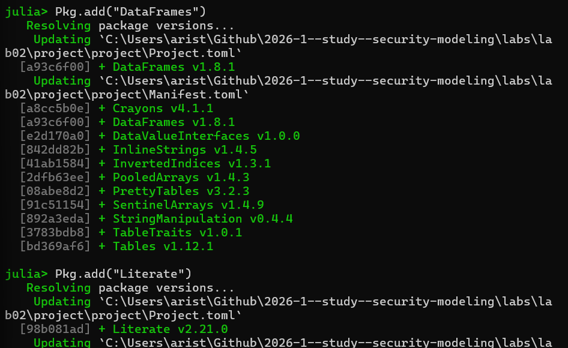{#fig-002 width=70%}


## Ядро моделирования:  Файл: src/simulation.jl

Создаём файл src/simulation.jl, функция simulate_attacks реализует вероятностную модель потока атак.

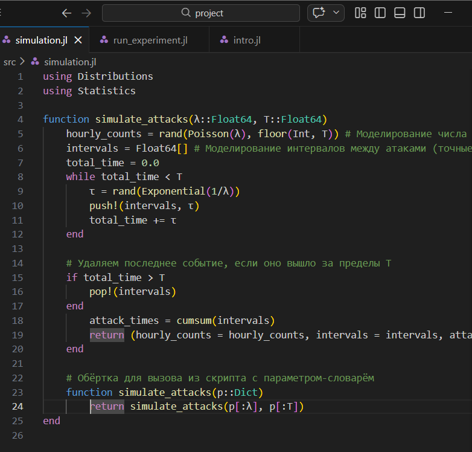{#fig-003 width=70%}

Эта функция: 

- Принимает интенсивность потока $\lambda$ (среднее число атак в час) и длительность наблюдения T (в часах).
- Генерирует две реализации потока:
  - Почасовое число атак (hourly_counts) — массив длины floor(Int, T), каждый элемент — случайное число из распределения Пуассона с параметром $\lambda$.
  - Точные моменты атак — моделирование экспоненциальных интервалов между событиями до тех пор, пока их сумма не превысит T. Возвращает массив интервалов intervals и массив моментов времени attack_times (накопленные суммы).
- Возвращает NamedTuple с тремя полями: hourly_counts, intervals,
attack_times.

Результат:

- Функция не сохраняет данные самостоятельно, а лишь возвращает структуру, которая затем используется в скриптах для дальнейшего анализа или
сохранения.

## Запуск эксперимента с сохранением результатов: однократный запуск эксперимента

Файл *scripts/run_experiment.jl*, который выполняет симуляцию с заданными параметрами, вычисляет эмпирическую вероятность события «более 10 атак за час» и сохраняет все результаты на диск.
Скрипт предназначен для первичной генерации данных, которые потом будут анализироваться.


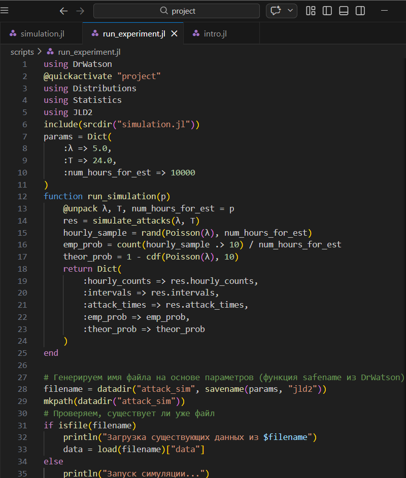{#fig-004 width=70%}

Файл вызывает simulate_attacks($\lambda$, T) для получения почасовых counts, интервалов и моментов времени, дополнительно генерирует большую выборку (num_hours_for_est) из распределения Пуассона для устойчивой оценки эмпирической вероятности
𝑃(𝑁1 > 10), вычисляет теоретическую вероятность 1 − 𝐹Poisson($\lambda$)(10), упаковывает все результаты в словарь и сохраняет в JLD2-файл (команда
@save).

Результат:

— В папке data/attack_sim/ создаётся файл с именем, отражающим параметры (например, attack_sim_$\lambda$=5.0_T=24.0_num_hours_for_est=10000.jld2).

— Внутри — словарь с ключами: :hourly_counts, :intervals, :attack_times,
:emp_prob, :theor_prob.

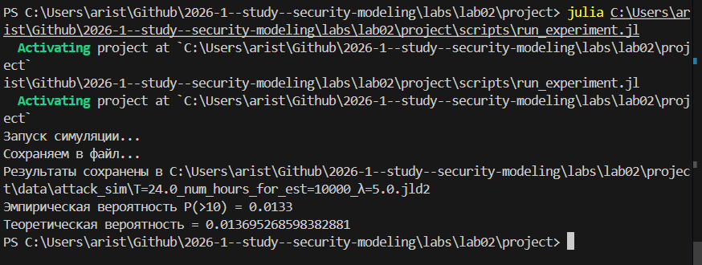{#fig-005 width=70%}

## Анализ и визуализация результатов одного эксперимента\

Файл *scripts/analyze.jl* загружает сохранённые данные и строит четыре диагностических графика,
позволяющих визуально оценить соответствие смоделированного потока теоретическим предположениям (пуассоновости и экспоненциальности).


{#fig-006 width=70%}

Результат:

— PNG-файл с четырьмя графиками, наглядно демонстрирующими свойства
сгенерированного потока.

— В консоль выводятся значения эмпирической и теоретической вероятностей

{#fig-007 width=70%}

Получаем сводный график для однократного эксперимента.

{#fig-008 width=70%}

## Исследование сходимости оценки вероятности

Файл *scripts/convergence.jl* позволяет изучить, как быстро эмпирическая оценка вероятности редкого
события приближается к теоретическому значению при увеличении объёма
выборки.Это важный практический аспект моделирования: для надёжной оценки
редких событий требуется большой объём данных.


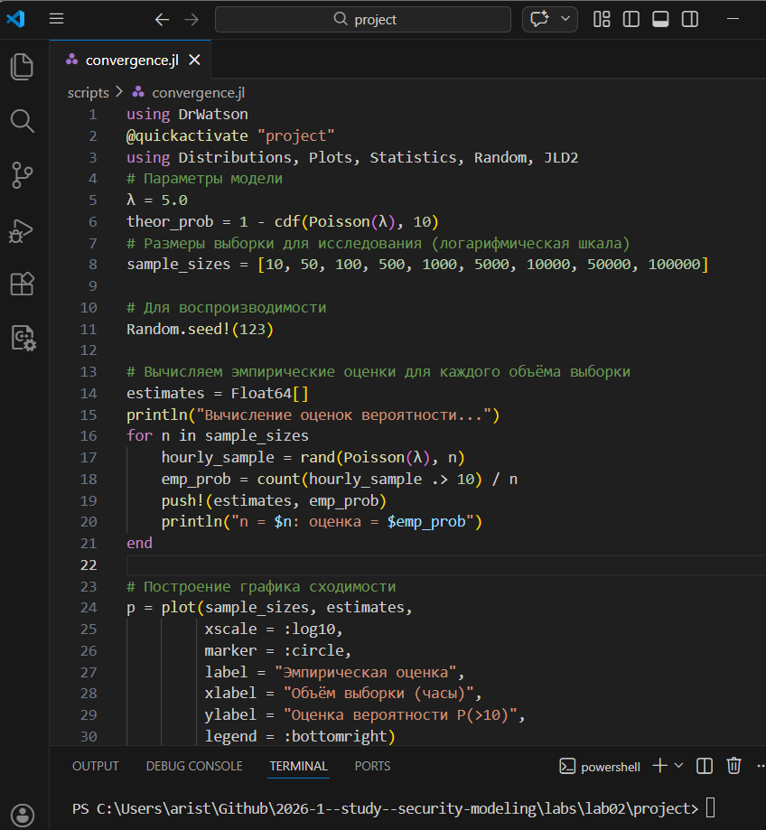{#fig-009 width=70%}

Результат:

— График, иллюстрирующий уменьшение случайной ошибки оценки с ростом
выборки, и файл с данными для повторного построения.

{#fig-010 width=70%}

График, иллюстрирующий уменьшение случайной ошибки оценки с ростом
выборки, и файл с данными для повторного построения.

{#fig-011 width=70%}

## Многовариантный эксперимент: параметрическое исследование 

Файл *scripts/parameter_sweep.jl* позволяет систематически изучить, как изменение интенсивности атак $\lambda$
влияет на характеристики потока и, в частности, на вероятность 𝑃(> 10).  Скрипт автоматизирует запуск множества экспериментов, сохраняет все
результаты и строит как обобщающий график, так и детальные графики для каждого значения $\lambda$.

{#fig-012 width=70%}

Выполняем этот файл. Результат:

— Набор JLD2-файлов для каждого $\lambda$ в data/attack_sim/.

— Детальные графики для каждого $\lambda$ в plots/parameter_sweep/.

— Сводная таблица (CSV) и файл с данными в data/parameter_sweep/.

— Обобщающий график в корне plots/, показывающий зависимость вероятности от интенсивности.

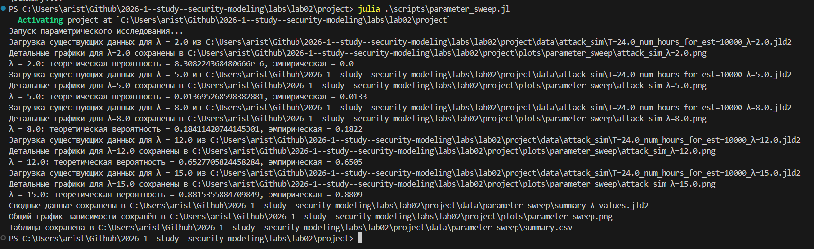{#fig-013 width=70%}

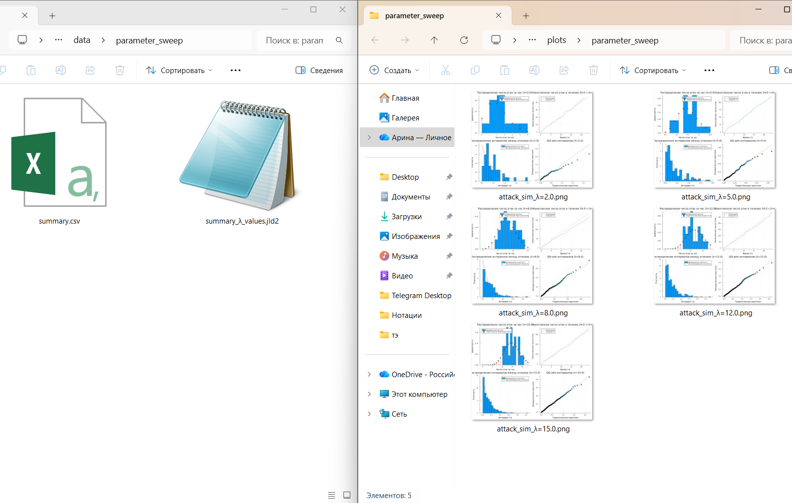{#fig-014 width=70%}

Детальные графики для каждого $\lambda$ в plots/parameter_sweep/.

{#fig-015 width=40%}

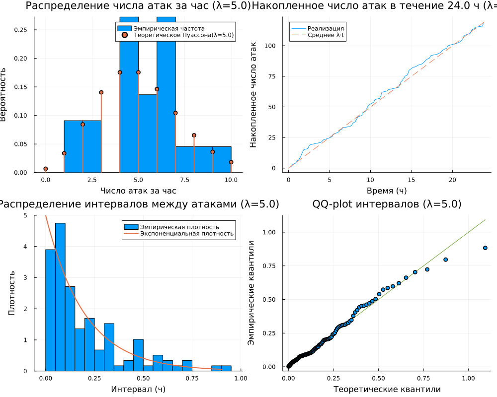{#fig-016 width=40%}

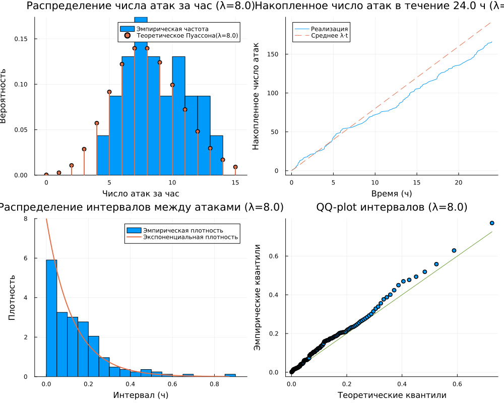{#fig-017 width=40%}

{#fig-018 width=40%}

{#fig-019 width=40%}


А также получаем график, показывающий зависимость вероятности от интенсивности.

{#fig-020 width=70%}

## Литературный стиль 

Преобразовываем в производные форматы с помощью файла *tangle.jl*


{#fig-021 width=70%}

В результате выполнения файла *tangle.jl* создались следующие файлы:

{#fig-022 width=70%}

Посмотрим и выполним jupyter nootebook -и.

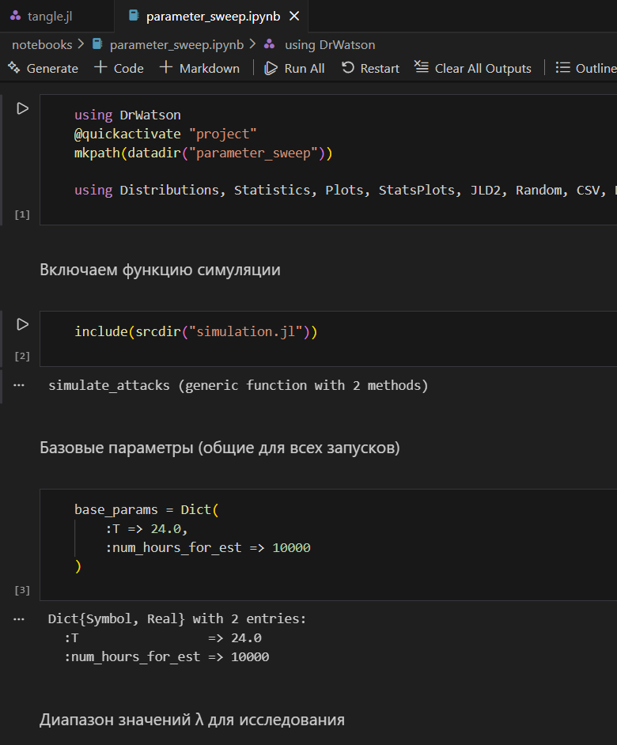{#fig-023 width=70%}

# Контрольные вопросы 


**1. Какими свойствами обладает простейший поток событий? Почему он часто используется для моделирования атак?**

  Простейший (пуассоновский) поток обладает тремя свойствами:

  1. **Стационарность** — вероятность появления $k$ событий за интервал длины $t$ зависит только от $t$ и не зависит от момента начала отсчёта.
  
  2. **Отсутствие последействия** — число событий в непересекающихся интервалах независимо.
  
  3. **Ординарность** — вероятность появления двух и более событий за бесконечно малый интервал пренебрежимо мала.

  Используется для моделирования атак потому что это математически простой и хорошо изученный процесс с готовыми аналитическими формулами. Согласно теореме Пальма–Хинчина, суперпозиция большого числа независимых стационарных ординарных потоков сходится к пуассоновскому — что соответствует реальной ситуации, когда атаки приходят от множества независимых источников.

**2. Как сгенерировать реализацию пуассоновского потока на интервале времени?**

  Используется метод на основе экспоненциального распределения интервалов. Алгоритм:

  1. Задать интенсивность $\lambda$ и длительность T.
  
  2. Установить t = 0.
  
  3. Генерировать τ ~ Exp($\lambda$), прибавлять к t.
  
  4. Если t ≤ T — записать момент события, иначе — остановиться.

**3. Как проверить, что интервалы между событиями распределены экспоненциально?**

Три способа:

  - **Гистограмма с теоретической плотностью** — строим гистограмму интервалов и накладываем кривую Exp($\lambda$). Если совпадают — распределение экспоненциальное.

  - **QQ-plot** — строим квантиль-квантильный график интервалов против теоретического экспоненциального распределения. В нашем коде это `qqplot(Exponential(1/$\lambda$), intervals, qqline = :identity)`. Если точки лежат на прямой y = x — распределение экспоненциальное.

  - **Критерий Колмогорова–Смирнова** — если p-value > 0.05, нет оснований отвергать гипотезу об экспоненциальности.

**4. В чём преимущества использования DrWatson для организации вычислительного эксперимента?**

  - **Стандартная структура проекта** — папки `src/`, `scripts/`, `data/`, `plots/` создаются автоматически.
  
  - **Воспроизводимость** — проект инициализируется как Julia-окружение с `Project.toml` и `Manifest.toml`, фиксируя версии всех пакетов.
  
  - **`@quickactivate`** — макрос гарантирует что скрипт выполняется в контексте именно этого проекта.
  
  - **`savename`** — автоматически формирует имя файла из словаря параметров, исключая путаницу между результатами разных запусков.
  
  - **Кэширование** — `produce_or_load` не пересчитывает результаты если файл уже существует.

**5. Что такое `produce_or_load` и как он работает?**

  `produce_or_load` — функция DrWatson для кэширования результатов вычислений. Логика работы:

  1. Формирует путь к файлу на основе параметров через `savename`.
  
  2. Если файл существует — загружает данные с диска, вычисление не запускается.
  
  3. Если файла нет — выполняет вычисление и сохраняет результат.

  В нашей лабораторной работе реализована та же логика вручную через `isfile` + `@save`/`@load`, что эквивалентно `produce_or_load`.

**6. Какая структура проекта создаётся DrWatson? Для чего нужны папки?**

  ```
  project/
  ├── data/         # результаты симуляций, сохранённые JLD2/CSV файлы
  ├── scripts/      # запускаемые скрипты
  ├── src/          # исходный код — функции и модули
  ├── plots/        # сохранённые графики
  ├── notebooks/    # Jupyter notebooks
  ├── markdown/     # Quarto-документация
  ├── Project.toml  # список зависимостей проекта
  └── Manifest.toml # зафиксированные версии всех пакетов
  ```

  `src/` — переиспользуемый код, подключается через `include(srcdir(...))`. 
  `scripts/` — точки входа, запускаются напрямую. 
  `data/` — только результаты, не редактируется вручную. 
  `plots/` — только графики, генерируются скриптами.

**7. Как задать набор параметров для множественных запусков в DrWatson?**

  Вынести параметры в отдельный файл `scripts/params.jl`:

  ```julia
  default_params = Dict(
      :$\lambda$ => 5.0,
      :T => 24.0,
      :num_hours_for_est => 10000
  )
  ```

  В других скриптах подключать и переопределять нужные поля через `merge`. Для множественных запусков — создавать список словарей и итерировать по нему, как реализовано в `parameter_sweep.jl` через цикл по `$\lambda$_values`.


# Дополнительные задания 


1.  Изменить интенсивность $\lambda$ (например, 2, 8, 12 атак/час) и сравнить результаты.

- При $\lambda$=2 распределение числа атак сдвинуто влево — пик около 1-2 атак за час, эмпирическая гистограмма хорошо совпадает с теоретическим Пуассоном(2). Интервалы между атаками большие — около 0.3-2 ч. Вероятность P(>10) близка к нулю (~8.3·10⁻⁶).
- При $\lambda$=8 распределение смещается вправо — пик около 7-8 атак за час, интервалы короткие — большинство менее 0.2 ч. Вероятность P(>10) резко возрастает (~0.184).

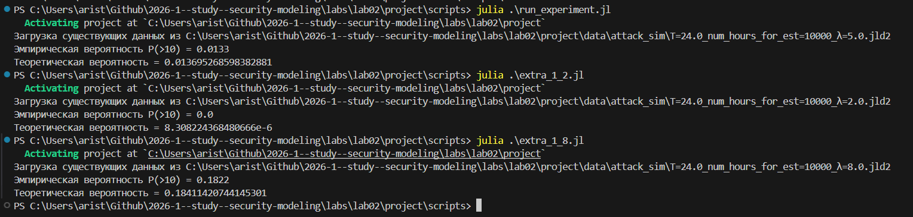{#fig-024 width=70%}


2. Моделировать нестационарный пуассоновский поток с интенсивностью, зависящей от времени суток: $\lambda(𝑡) = 2 + 5 sin(\pi t/12)$. Модифицировать функцию
симуляции (использовать метод прореживания или неоднородный пуассоновский процесс).

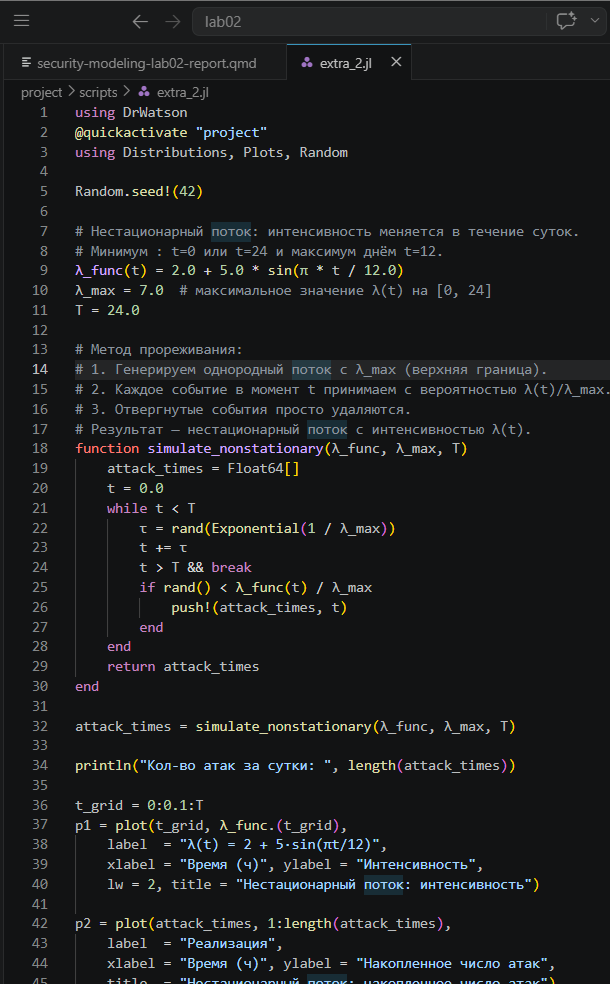{#fig-025 width=70%}

{#fig-026 width=70%}

3. Исследовать вероятность события «ни одной атаки за смену (8 часов)» или «не менее 3 атак за 30 минут»

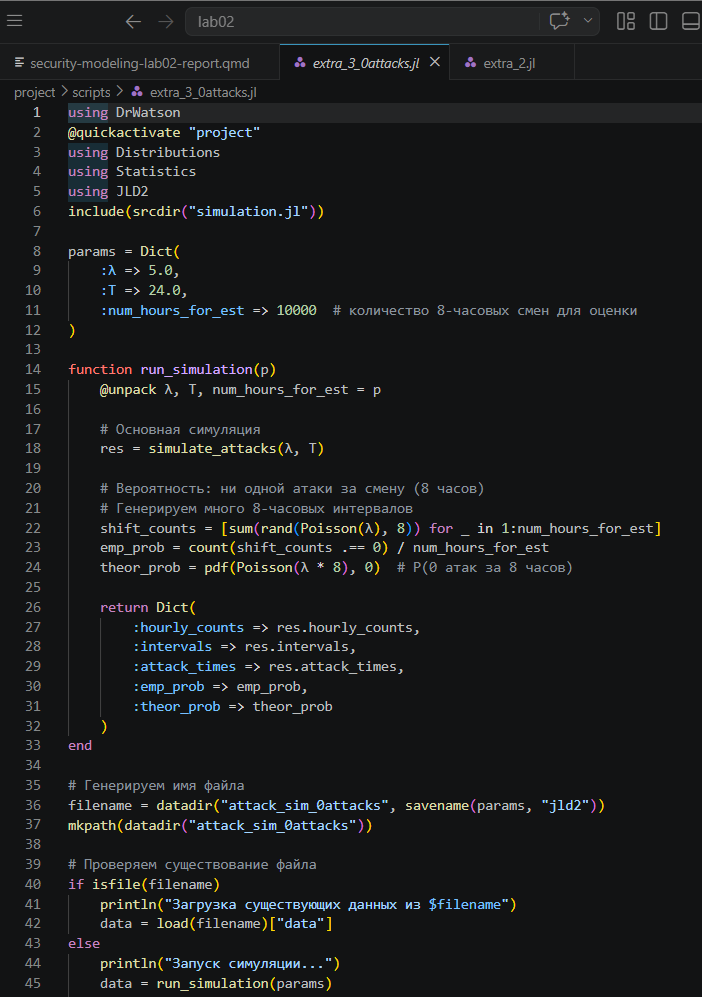{#fig-027 width=70%}

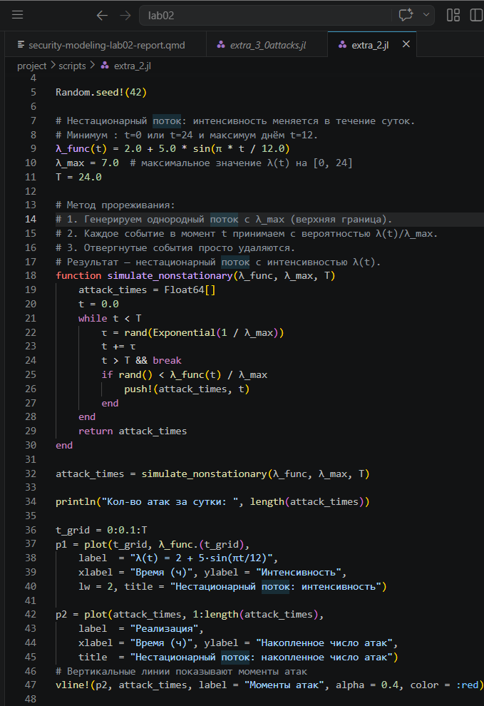{#fig-028 width=70%}

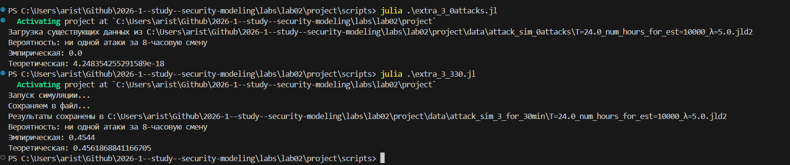{#fig-029 width=70%}

4. Оценить доверительный интервал для вероятности редкого события методом
бутстрепа.

С помощью бутстрапа и прореживания потока находим 95-проуентный ДИ и визуализируем. 

{#fig-030 width=70%}

{#fig-031 width=70%}

{#fig-032 width=70%}


5. Добавить в модель возможность успешности атаки: каждая атака имеет вероятность успеха 𝑝, тогда успешные атаки образуют прореженный п

Добавляем вероятность успешности атаки и рассчитываем соответствующие вероятности. 


{#fig-033 width=70%}

{#fig-034 width=70%}









# Выводы

1. Сформирована структура рабочего пространства на основе DrWatson, обеспечивающая разделение исходных кодов, данных и документации.
2. Реализована симуляция пуассоновского потока атак двумя способами: почасовые счётчики из распределения Пуассона и точные моменты через экспоненциальные интервалы.
3. Выполнен статистический анализ результатов: гистограммы, накопленный график, QQ-plot — все подтверждают соответствие теоретическим распределениям.
4. Проведено параметрическое исследование: показана зависимость P(>10) от интенсивности $\lambda$ — при росте $\lambda$ от 2 до 15 вероятность возрастает от ~0 до ~0.88.
5. Исследована сходимость оценки вероятности редкого события: для надёжной оценки P(>10) при $\lambda$=5 необходим объём выборки порядка 10 000–100 000 часов.
6. Выполнена интеграция вычислительных экспериментов с их описанием за счёт преобразования кода в литературный стиль.
7. Автоматизирована генерация артефактов (чистый код, Notebook, отчёт Quarto), что повышает воспроизводимость исследования.

# Список литературы{.unnumbered}

::: {#refs}
:::

1. Описание лабораторных работ 
