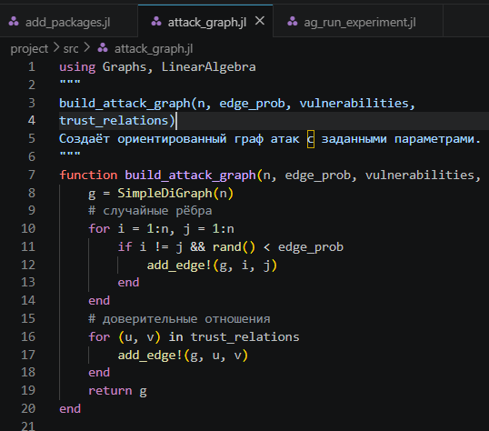
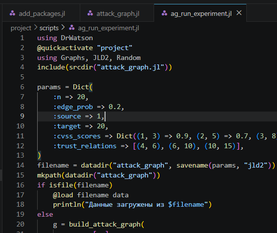
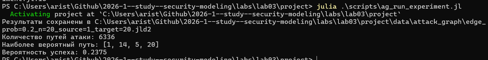
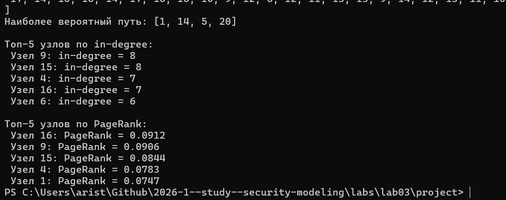
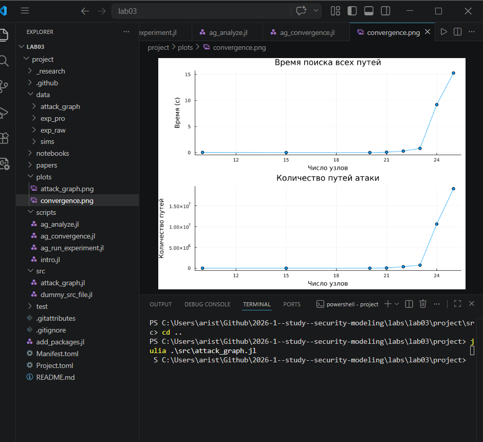
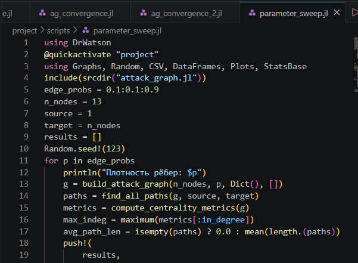
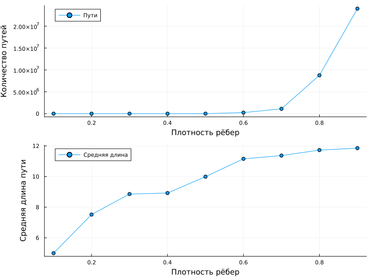

---
## Author
author:
  name: Аристова Арина Олеговна
  degrees: MSc
  email: 1032259382@rudn.ru
  affiliation:
    - name: Российский университет дружбы народов
      country: Российская Федерация
      postal-code: 117198
      city: Москва
      address: ул. Миклухо-Маклая, д. 6
## Title
title: "Лабораторная работа №3"
subtitle: "Моделирование графов атак"
license: CC BY
date: today
date-format: "YYYY-MM-DD"

format:
  beamer:
    lang: ru-RU
    colortheme: default                 
    mainfont: Arial
    monofont: Courier New
    aspectratio: 169
    incremental: false
    toc: false
    footer: false
    slide-number: true
    include-in-header: 
      text: |
        \setbeamertemplate{navigation symbols}{}
        \setbeamertemplate{headline}{}
        \setbeamertemplate{footline}{
          \hfill
          {\small \insertframenumber}
          \hspace{2em}
          \vspace{2em}
        }
        \setbeamertemplate{title page}[empty]
---

## Докладчик

:::::::::::::: {.columns align=center}
::: {.column width="70%"}

  * Аристова Арина Олеговна
  * студентка группы НФИмд-01-25
  * Российский университет дружбы народов
  * [1032259382@rudn.ru](mailto:1032259382@rudn.ru)
  * <https://github.com/aoaristova>

:::
::: {.column width="30%"}

:::
::::::::::::::

## Цель работы

- Освоить методы построения и анализа графов атак для оценки уязвимостей
сетевой инфраструктуры.
- На примере моделирования атак на корпоративную сеть изучить:

  - представление сетевой топологии и уязвимостей в виде ориентированного
  графа;
  - алгоритмы поиска всех возможных путей атаки от начальных точек до
  целевых активов;
  - расчёт метрик центральности для определения критических узлов;
  - визуализацию графа с цветовой индикацией уровня риска;
  - оценку вероятности успешной атаки с учётом сложности эксплуатации
  уязвимостей.

## Задание

- Построить граф атак для заданной топологии сети.
- Реализовать алгоритм поиска всех путей от заданного источника к цели.
- Рассчитать метрики центральности для всех узлов и выявить наиболее критичные.
- Визуализировать граф, раскрашивая узлы в зависимости от степени риска
- Присвоить каждому ребру вес (вероятность успешной атаки) и вычислить наи-
более вероятный путь атаки

# Выполнение лабораторной работы

## Ядро моделирования графа атак 

Содержит все функции для построения ориентированного графа атак, поиска
путей, расчёта метрик центральности, присвоения весов и нахождения наиболее
вероятного пути. Это основной модуль, используемый всеми скриптами.

## Ядро моделирования графа атак 

{#fig-001 width=40%}

## Однократный запуск эксперимента

***Файл scripts/ag_run_experiment.jl*** выполняет построение графа атак для заданных параметров, находит все пути,
вычисляет метрики центральности, определяет наиболее вероятный путь и со-
храняет результаты в JLD2-файл. Предназначен для генерации данных, которые
будут анализироваться в других скриптах

## Однократный запуск эксперимента

{#fig-002 width=40%}

## Однократный запуск эксперимента

**Результат:**

В папке data/attack_graph/ создаётся файл. В нём хранятся:

  - :graph - объект графа;
  - :paths - массив всех путей;
  - :metrics - словарь с метриками центральности;
  - :weights - веса рёбер;
  - :likely_path - массив узлов наиболее вероятного пути;
  - :probability - числовая вероятность успеха

## Однократный запуск эксперимента

{#fig-003 width=70%}

## Однократный запуск эксперимента

{#fig-004 width=70%}

## Визуализация и анализ графа

***Файл scripts/ag_analyze.jl*** загружает сохранённые данные. Строит наглядное изображение графа (с цвето-
вой индикацией по PageRank). Выводит статистику: количество узлов, рёбер, пути,
топ-5 критичных узлов по in-degree и PageRank.

{#fig-005 width=40%}

## Визуализация и анализ графа

**Результат:**

- PNG-файл с визуализацией графа в папке plots/.
- Текстовый отчёт в консоли.

## Визуализация и анализ графа

{#fig-006 width=70%}

## Визуализация и анализ графа

{#fig-007 width=50%}

## Исследование масштабируемости

***Файл scripts/ag_convergence.jl*** исследование, как размер сети (число узлов) влияет на время поиска всех путей и
на количество найденных путей. Позволяет оценить вычислительную сложность
алгоритма.

{#fig-008 width=50%}

## Исследование масштабируемости

**Результат:**

- График convergence.png, показывающий рост времени и числа путей с увели-
чением сети
- JLD2‑файл с данными для возможного повторного использования.

## Исследование масштабируемости

{#fig-009 width=50%}

## Исследование масштабируемости

{#fig-010 width=70%}

## Параметрическое исследование

***Файл scripts/parameter_sweep.jl*** изучает, как изменение плотности рёбер (вероятности случайного ребра) влияет
на количество путей атаки, максимальную входящую степень и среднюю длину
пути.

{#fig-011 width=50%}

## Параметрическое исследование

**Результат:**

- Таблица результатов в CSV.
- Графики (рис. 3.3), показывающие, как увеличение связности графа (плотно-
сти) приводит к росту числа путей и их средней длины.

## Параметрическое исследование

{#fig-012 width=55%}

## Параметрическое исследование

{#fig-013 width=70%}

## Выводы

В результате данной лабораторно работы освоены методы построения и анализа графов атак для оценки уязвимостей сетевой инфраструктуры, а также выполнен пример моделирования атак на корпоративную сеть.

## Список литературы

1. Описание лабораторной работы