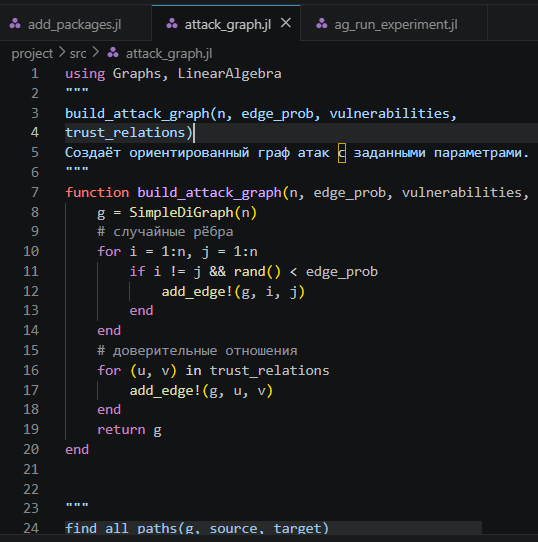
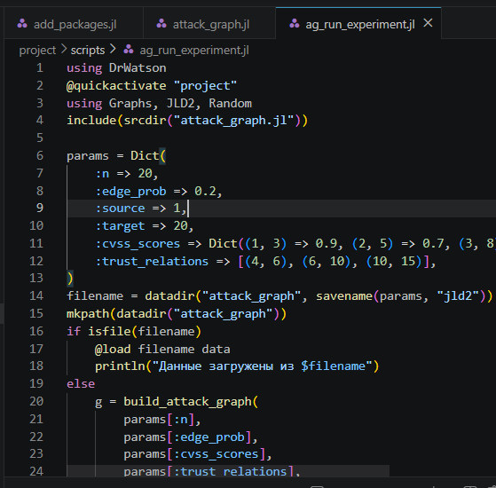
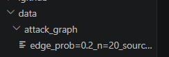
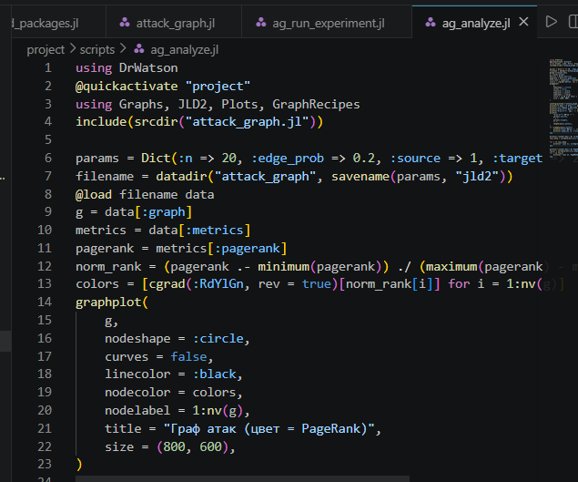
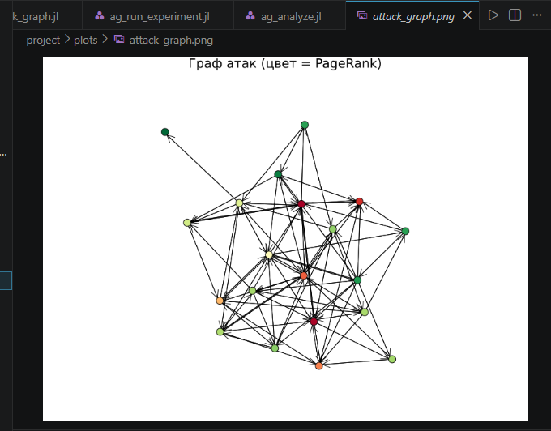
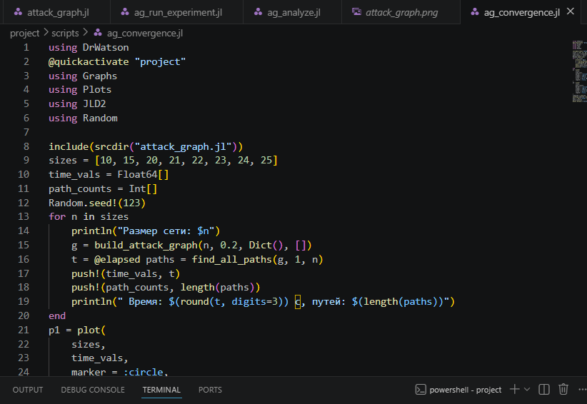
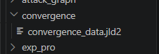
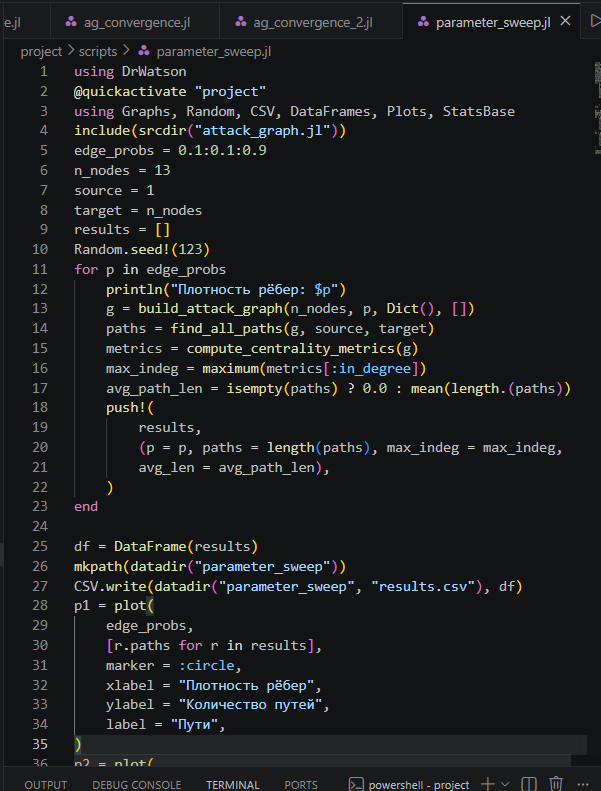
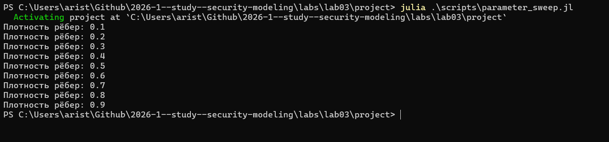

---
## Author
author:
  name: Аристова Арина Олеговна
  degrees: MSc
  email: 1032259382@rudn.ru
  affiliation:
    - name: Российский университет дружбы народов
      country: Российская Федерация
      postal-code: 117198
      city: Москва
      address: ул. Миклухо-Маклая, д. 6

## Title
title: "Лабораторная работа №3"
subtitle: "Моделирование графов атак"
license: "CC BY"
---

# Цель работы

- Освоить методы построения и анализа графов атак для оценки уязвимостей
сетевой инфраструктуры.
- На примере моделирования атак на корпоративную сеть изучить:

  - представление сетевой топологии и уязвимостей в виде ориентированного
  графа;
  - алгоритмы поиска всех возможных путей атаки от начальных точек до
  целевых активов;
  - расчёт метрик центральности для определения критических узлов;
  - визуализацию графа с цветовой индикацией уровня риска;
  - оценку вероятности успешной атаки с учётом сложности эксплуатации
  уязвимостей.

# Задание

- Построить граф атак для заданной топологии сети.
- Реализовать алгоритм поиска всех путей от заданного источника к цели.
- Рассчитать метрики центральности для всех узлов и выявить наиболее критичные.
- Визуализировать граф, раскрашивая узлы в зависимости от степени риска
- Присвоить каждому ребру вес (вероятность успешной атаки) и вычислить наи-
более вероятный путь атаки

# Выполнение лабораторной работы

## Ядро моделирования графа атак 

Содержит все функции для построения ориентированного графа атак, поиска
путей, расчёта метрик центральности, присвоения весов и нахождения наиболее
вероятного пути. Это основной модуль, используемый всеми скриптами.

{#fig-001 width=70%}



## Однократный запуск эксперимента

***Файл scripts/ag_run_experiment.jl*** выполняет построение графа атак для заданных параметров, находит все пути,
вычисляет метрики центральности, определяет наиболее вероятный путь и со-
храняет результаты в JLD2-файл. Предназначен для генерации данных, которые
будут анализироваться в других скриптах

{#fig-002 width=70%}



**Результат:**

В папке data/attack_graph/ создаётся файл. В нём хранятся:

  - :graph - объект графа;
  - :paths - массив всех путей;
  - :metrics - словарь с метриками центральности;
  - :weights - веса рёбер;
  - :likely_path - массив узлов наиболее вероятного пути;
  - :probability - числовая вероятность успеха

{#fig-003 width=70%}

{#fig-004 width=70%}

## Визуализация и анализ графа

***Файл scripts/ag_analyze.jl*** загружает сохранённые данные. Строит наглядное изображение графа (с цвето-
вой индикацией по PageRank). Выводит статистику: количество узлов, рёбер, пути,
топ-5 критичных узлов по in-degree и PageRank.

{#fig-005 width=70%}



**Результат:**

- PNG-файл с визуализацией графа в папке plots/.
- Текстовый отчёт в консоли.

{#fig-006 width=70%}

{#fig-007 width=70%}

## Исследование масштабируемости

***Файл scripts/ag_convergence.jl*** исследование, как размер сети (число узлов) влияет на время поиска всех путей и
на количество найденных путей. Позволяет оценить вычислительную сложность
алгоритма.

{#fig-008 width=70%}



**Результат:**

- График convergence.png, показывающий рост времени и числа путей с увели-
чением сети (рис. 3.2).
- JLD2‑файл с данными для возможного повторного использования.

{#fig-009 width=70%}

{#fig-010 width=70%}

## Параметрическое исследование

***Файл scripts/parameter_sweep.jl*** изучает, как изменение плотности рёбер (вероятности случайного ребра) влияет
на количество путей атаки, максимальную входящую степень и среднюю длину
пути.

{#fig-011 width=70%}



**Результат:**

- Таблица результатов в CSV.
- Графики (рис. 3.3), показывающие, как увеличение связности графа (плотно-
сти) приводит к росту числа путей и их средней длины.

{#fig-012 width=70%}

{#fig-013 width=70%}

## Контрольные вопросы

1. Граф атак - направленный граф возможных действий злоумышленника для достижения цели. Вершины - состояния системы, рёбра - переходы через уязвимости. Используется для оценки защищённости, выявления маршрутов атак, расчёта метрик опасности, анализа рисков и расследования инцидентов.

2. Для поиска путей в графах атак применяются различные алгоритмы, например: BFS (кратчайший путь), Дейкстра (взвешенные графы), A* (с эвристикой), Беллман–Форд (отрицательные веса), Флойд–Уоршелл (все пары вершин). Веса рёбер могут отражать сложность или вероятность успеха атаки.

3. Метрики центральности определяют важность узлов в графе. 
  * In-degree - число входящих рёбер (указывает на частоту атак на узел). 
  * PageRank - учитывает важность связанных узлов (показывает влияние на распространение угроз).

4. Вероятность успешной атаки оценивается через произведение весов рёбер на пути (вероятности успеха перехода). Для поиска наиболее вероятного пути используют модифицированный алгоритм Дейкстры или A*. Сложные модели - байесовские графы атак.

5. Ограничения модели: масштабируемость (экспоненциальный рост числа путей), неопределённость данных, динамичность сетей, сложность с циклами и защитными механизмами, высокие вычислительные затраты.

6. Учёт защитных механизмов (например, МЭ): добавление узлов/рёбер защиты, условные переходы (блокировка → обнуление веса), атрибуты правил фильтрации, вероятностные модели (шанс обнаружения), интеграция конфигураций правил доступа и многоуровневые модели безопасности.

# Выводы

В результате данной лабораторно работы освоены методы построения и анализа графов атак для оценки уязвимостей сетевой инфраструктуры, а также выполнен пример моделирования атак на корпоративную сеть.

# Список литературы{.unnumbered}

::: {#refs}
:::

1. Описание лабораторных работ 

