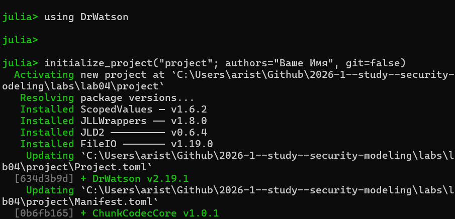
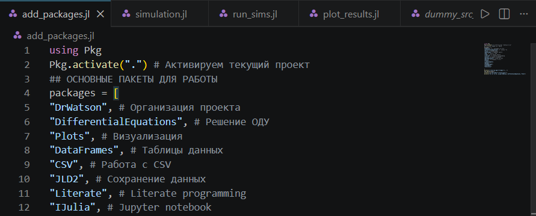
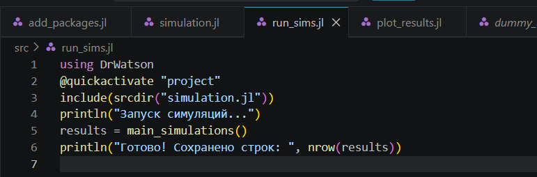
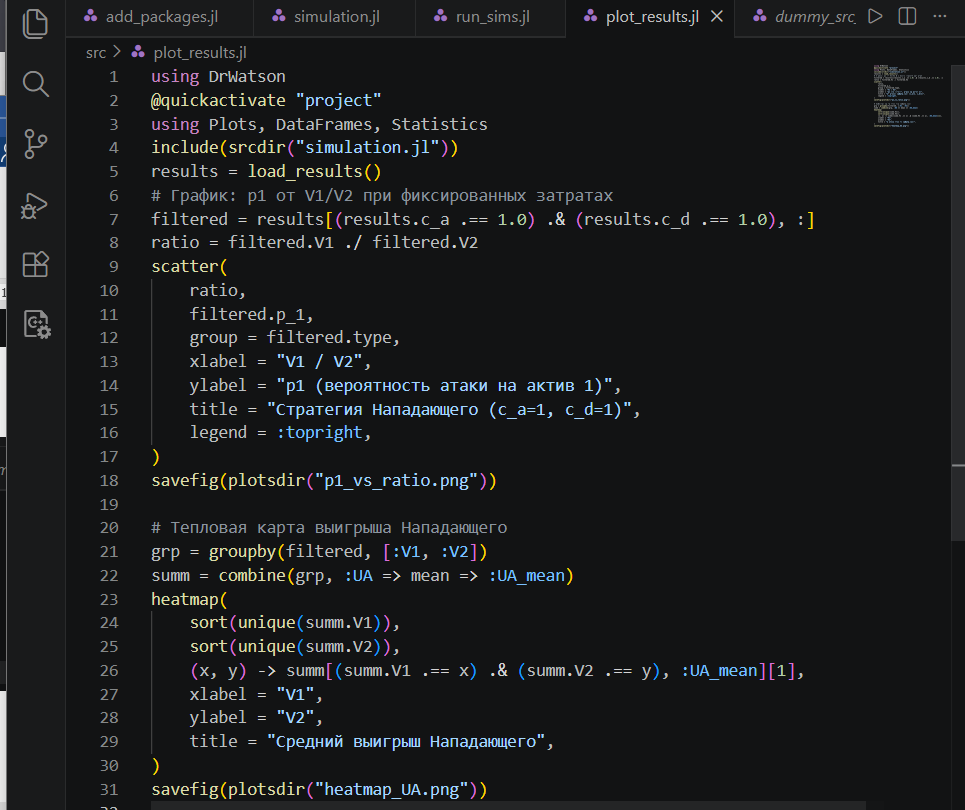
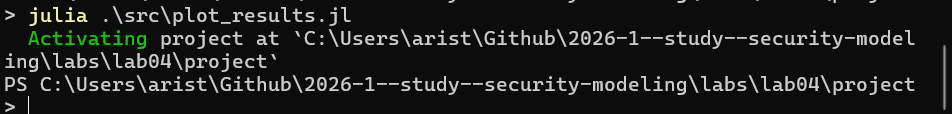

---
## Author
author:
  name: Аристова Арина Олеговна
  degrees: MSc
  email: 1032259382@rudn.ru
  affiliation:
    - name: Российский университет дружбы народов
      country: Российская Федерация
      postal-code: 117198
      city: Москва
      address: ул. Миклухо-Маклая, д. 6
## Title
title: "Лабораторная работа №4"
subtitle: "Моделирование конфликта Защитник-Нападающий"
license: CC BY
date: today
date-format: "YYYY-MM-DD"

format:
  beamer:
    lang: ru-RU
    colortheme: default                 
    mainfont: Arial
    monofont: Courier New
    aspectratio: 169
    incremental: false
    toc: false
    footer: false
    slide-number: true
    include-in-header: 
      text: |
        \setbeamertemplate{navigation symbols}{}
        \setbeamertemplate{headline}{}
        \setbeamertemplate{footline}{
          \hfill
          {\small \insertframenumber}
          \hspace{2em}
          \vspace{2em}
        }
        \setbeamertemplate{title page}[empty]
---

## Докладчик

:::::::::::::: {.columns align=center}
::: {.column width="70%"}

  * Аристова Арина Олеговна
  * студентка группы НФИмд-01-25
  * Российский университет дружбы народов
  * [1032259382@rudn.ru](mailto:1032259382@rudn.ru)
  * <https://github.com/aoaristova>

:::
::: {.column width="30%"}

:::
::::::::::::::

## Цель работы

Освоить применение теории игр для анализа противостояния в сфере информационной безопасности. Научиться строить матричную игру, находить равновесие
Нэша в чистых и смешанных стратегиях.

## Задание

- Формализовать конфликт «Защитник–Нападающий» в виде антагонистической игры.
- Реализовать на Julia функции расчёта платёжной матрицы, поиска равновесия
Нэша и симуляции игры.
- Визуализировать зависимость ожидаемого выигрыша и равновесных вероятностей от стоимости защиты и величины ущерба.

# Выполнение лабораторной работы

## Создание проекта

Я инициализировала проект и установила необходимые пакеты для дальнейшей работы с помощью скрипта ***add_packages.jl***

{#fig-001 width=60%}

## Создание проекта

{#fig-002 width=60%}

## Основной модуль

Файл ***src/simulation.jl*** является основным модулем, используемым для моделирования. Он содержит несколько функций: 

- ***build_payoff_matrices(V::Vector{Float64}, c_a::Float64,
c_d::Float64)*** строит две платёжные матрицы игры размера n × n 
- ***mixed_nash_2x2(A::Matrix{Float64}, D::Matrix{Float64})***  ищет равновесие Нэша для биматричной игры 2×2
- ***run_simulation(params::Dict)*** проводит один эксперимент с заданными параметрами игры
- ***generate_params()*** формирует полную сетку параметров для симуляционного эксперимента. Перебирает все комбинации:
  - ценностей V1 ∈ {5, 10, 15}, V2 ∈ {5, 10, 15}
  - затрат c_a ∈ {0, 1, 3}, c_d ∈ {0, 1, 3}
- ***main_simulations()***:  Основная функция запуска всех симуляций.
- ***load_results()*** загружает ранее сохранённые результаты из CSV-файла

## Основной модуль

{#fig-003 width=60%}

## Запуск симуляций

Что делает:

- Печатает сообщение о запуске.
- Выполняет main_simulations() (все комбинации параметров).
- Выводит количество рассчитанных вариантов.

## Запуск симуляций

{#fig-004 width=70%}

## Построение графиков

Файл ***scripts/plot_results.jl***:

- Загружает результаты через load_results().
- Фильтрует строки с c_a = 1.0 и c_d = 1.0.
- Строит точечный график (scatter). Зависимость вероятности атаки на первый
актив p1 от отношения ценностей V1/V2 (рис. 4.1). Точки разделены по типу
равновесия (pure/mixed). Сохраняет в plots/p1_vs_ratio.png.
- Группирует отфильтрованные данные по V1 и V2, вычисляет средний ожидаемый выигрыш Нападающего UA_mean.
- Строит тепловую карту (heatmap). Средний выигрыш Нападающего в координатах (V1, V2) (рис. 4.2). Сохраняет в plots/heatmap_UA.png.

## Построение графиков

{#fig-005 width=50%}

## Построение графиков

Запускаем этот скрипт: 

{#fig-006 width=70%}

## Построение графиков

В результате выполнения ***scripts/plot_results.jl*** получаем следующие графики:

{#fig-009 width=60%}

## Построение графиков

{#fig-010 width=60%}

## Генерация производных форматов 

Генерируем производные форматы с помощью скрипта ***tangle.jl***:

{#fig-011 width=60%}

## Генерация производных форматов 

Получаем файлы других форматов: Jupyter notebook, .qmd - Quarto markdown:

{#fig-012 width=40%}

## Выводы

В результате данной лабораторноЙ работы освоено применение теории игр для анализа противостояния в сфере информационной безопасности. Построена матричная игра, найдено равновесие Нэша в чистых и смешанных стратегиях.

## Список литературы

1. Описание лабораторной работы