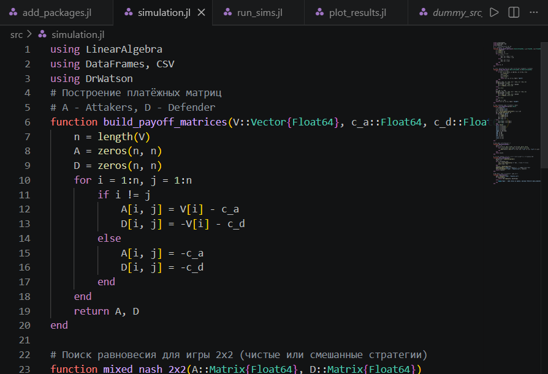
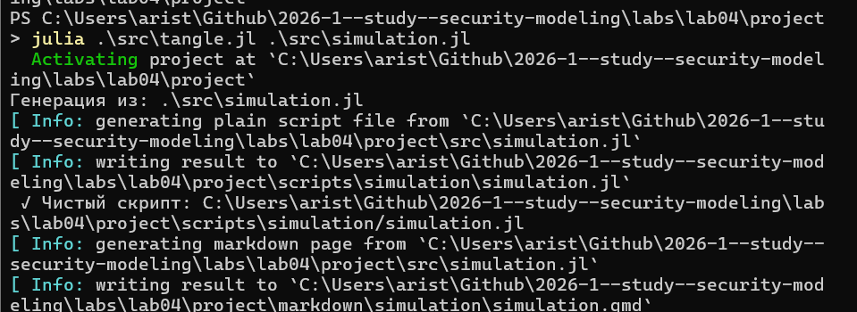
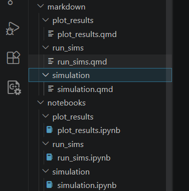

---
## Author
author:
  name: Аристова Арина Олеговна
  degrees: MSc
  email: 1032259382@rudn.ru
  affiliation:
    - name: Российский университет дружбы народов
      country: Российская Федерация
      postal-code: 117198
      city: Москва
      address: ул. Миклухо-Маклая, д. 6

## Title
title: "Лабораторная работа №4"
subtitle: "Моделирование конфликта Защитник-Нападающий"
license: "CC BY"
---

# Цель работы

Освоить применение теории игр для анализа противостояния в сфере информационной безопасности. Научиться строить матричную игру, находить равновесие
Нэша в чистых и смешанных стратегиях.

# Задание

- Формализовать конфликт «Защитник–Нападающий» в виде антагонистической игры.
- Реализовать на Julia функции расчёта платёжной матрицы, поиска равновесия
Нэша и симуляции игры.
- Визуализировать зависимость ожидаемого выигрыша и равновесных вероятностей от стоимости защиты и величины ущерба.

# Выполнение лабораторной работы

## Создание проекта

Я инициализировала проект и установила необходимые пакеты для дальнейшей работы с помощью скрипта ***add_packages.jl***

{#fig-001 width=70%}

{#fig-002 width=70%}

## Основной модуль

Файл ***src/simulation.jl*** является основным модулем, используемым для моделирования. Он содержит несколько функций: 

- ***build_payoff_matrices(V::Vector{Float64}, c_a::Float64,
c_d::Float64)*** строит две платёжные матрицы игры размера n × n 
- ***mixed_nash_2x2(A::Matrix{Float64}, D::Matrix{Float64})***  ищет равновесие Нэша для биматричной игры 2×2
- ***run_simulation(params::Dict)*** проводит один эксперимент с заданными параметрами игры
- ***generate_params()*** формирует полную сетку параметров для симуляционного эксперимента. Перебирает все комбинации:
  - ценностей V1 ∈ {5, 10, 15}, V2 ∈ {5, 10, 15}
  - затрат c_a ∈ {0, 1, 3}, c_d ∈ {0, 1, 3}
- ***main_simulations()***:  Основная функция запуска всех симуляций.
- ***load_results()*** загружает ранее сохранённые результаты из CSV-файла

{#fig-003 width=70%}



## Запуск симуляций

Что делает:
- Печатает сообщение о запуске.
- Выполняет main_simulations() (все комбинации параметров).
- Выводит количество рассчитанных вариантов.

{#fig-004 width=70%}



## Построение графиков

Файл ***scripts/plot_results.jl***:

- Загружает результаты через load_results().
- Фильтрует строки с c_a = 1.0 и c_d = 1.0.
- Строит точечный график (scatter). Зависимость вероятности атаки на первый
актив p1 от отношения ценностей V1/V2 (рис. 4.1). Точки разделены по типу
равновесия (pure/mixed). Сохраняет в plots/p1_vs_ratio.png.
- Группирует отфильтрованные данные по V1 и V2, вычисляет средний ожидаемый выигрыш Нападающего UA_mean.
- Строит тепловую карту (heatmap). Средний выигрыш Нападающего в координатах (V1, V2) (рис. 4.2). Сохраняет в plots/heatmap_UA.png.

{#fig-005 width=70%}



Запускаем этот скрипт: 

{#fig-006 width=70%}

В результате выполнения ***scripts/plot_results.jl*** получаем следующие графики:

{#fig-009 width=70%}

{#fig-010 width=70%}

Генерируем производные форматы с помощью скрипта ***tangle.jl***:

{#fig-011 width=70%}

Получаем файлы других форматов: Jupyter notebook, .qmd - Quarto markdown:

{#fig-012 width=70%}

## Контрольные вопросы

1. Что такое антагонистическая игра? Почему модель «Защитник–Нападающий» можно считать игрой с нулевой суммой?

**Антагонистическая игра** - игра с прямо противоположными интересами игроков: выигрыш одного равен проигрышу другого.

Модель является игрой с **нулевой суммой**, так как сумма выигрышей постоянна:
- При успешной атаке: $(V_i - c_a) + (-V_i - c_d) = -c_a - c_d$
- При отражённой атаке: $(-c_a) + (-c_d) = -c_a - c_d$

Выигрыш Нападающего - это ущерб Защитника, что отражает антагонизм их интересов.

2. Дайте определение равновесия Нэша в чистых и смешанных стратегиях. Приведите пример, когда равновесия в чистых стратегиях не существует.
**Равновесие Нэша** - набор стратегий, при котором ни одному игроку не выгодно отклоняться в одностороннем порядке.

- **В чистых стратегиях**: каждый игрок выбирает одно действие с вероятностью 1
- **В смешанных стратегиях**: игроки рандомизируют действия, выбирая вероятностное распределение

**Пример отсутствия чистого равновесия** - игра «Орлянка»:
  Орел Решка
  Орел 1 -1
  Решка -1 1
Ни одна из четырёх клеток не является равновесием, но существует смешанное равновесие (0.5, 0.5).

3. Как изменится равновесная стратегия защитника, если ущерб от успешной атаки на незащищённый сервер станет бесконечно большим?

При `V1 → $\inf$`:
- Вероятность защиты первого актива `q1* → 1`
- Защитник **всегда защищает** критически важный актив
- Нападающий вынужден атаковать именно этот актив (`p1* → 1`)

**Практический смысл**: критически важные активы (банковские БД, системы управления АЭС) должны защищаться всегда, независимо от затрат.

4. Зачем в информационной безопасности применяют смешанные стратегии? Приведите реальные примеры рандомизации в защите.
**Причины применения**:

1. **Непредсказуемость** - противник не может изучить паттерны
2. **Минимизация максимального ущерба** - гарантированный уровень безопасности
3. **Оптимальное распределение ресурсов** - «размазывание» риска

**Реальные примеры**:

- **Honeypot** - случайное развёртывание ложных сервисов-ловушек
- **ASLR** - случайное размещение кода в памяти ОС
- **Рандомизированные аудиты** - внезапные проверки безопасности
- **Ротация портов** - динамическое перераспределение сетевых сервисов
- **Случайное сканирование** - непредсказуемое время запуска сканеров уязвимостей

# Выводы

В результате данной лабораторноЙ работы освоено применение теории игр для анализа противостояния в сфере информационной безопасности. Построена матричная игра, найдено равновесие Нэша в чистых и смешанных стратегиях.

# Список литературы{.unnumbered}

::: {#refs}
:::

1. Описание лабораторных работ 

